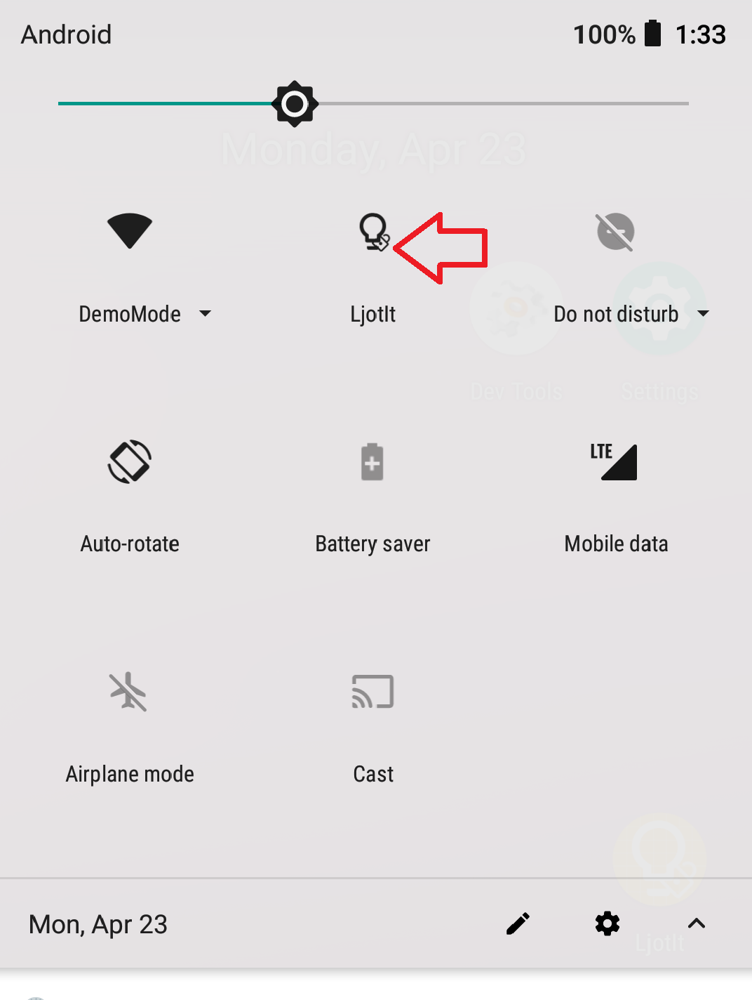

# LjotIt - Take notes on lock screen & send to Keep

Ever want to jot down some notes but are tired of unlocking your phone, e.g., during listening to podcast or attending lectures? If so, LjotIt is for you.

With LjotIt, you can take notes without unlocking the phone. Once the phone is unlocked, the notes will be sent to Google Keep. It can also work with other note taking applications: OneNote, Evernote, etc.

It also has a few other nifty features that compliments Google Keep:
- With its dark theme, you can also use LjotIt to take notes at late night, reducing eye strain. 
- The bundled quick settings tile (Android 7+), allows you to create a new Google Keep note from quick settings panel.

## Screenshots

### Access from lock screen
(using quick settings, for devices with Android 7 or later)

### Write down your note

### Send to Google Keep once unlocked

### Access from lock screen using notifications
(for devices with Android 5 or later)

